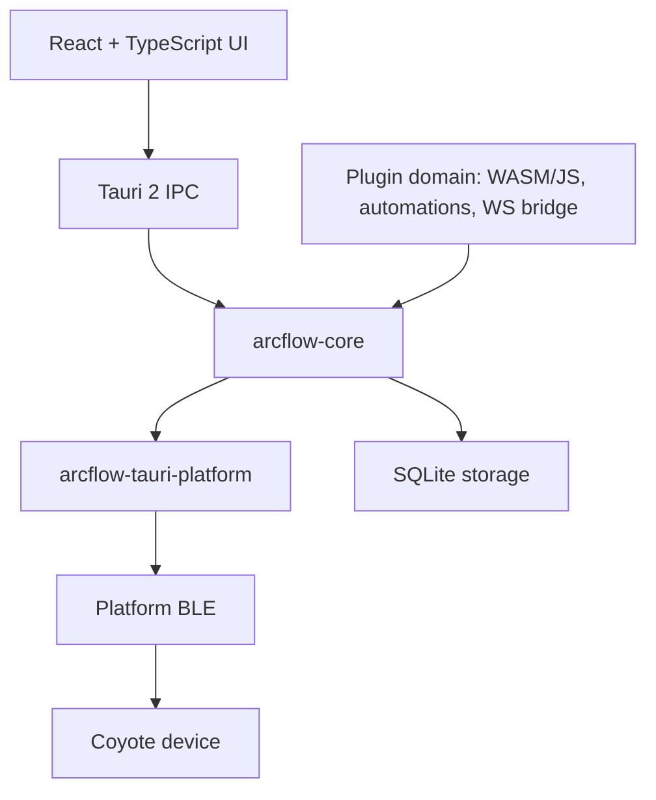

# ArcFlow Architecture

ArcFlow is a Rust-first, plugin-first client for compatible electrostimulation
devices. Desktop and mobile shells use Tauri 2 with a React UI; Rust owns device
access, safety, storage, protocol handling, and the plugin domain.

## Runtime Shape

React does not call Bluetooth, SQLite, or plugin runtimes directly. UI commands
cross Tauri IPC into Rust. Plugin runtimes, plugin automations, and plugin
bridge clients also route through Rust Core and capability checks before any
device-facing operation.

## Workspace Crates

- `crates/core`: orchestration, safety limits, BLE seams, Coyote command
  builders, plugin automation execution, Plugin API bridge, and plugin bridge
  request routing.
- `crates/tauri-platform`: Tauri 2 desktop/mobile platform adapters. The current
  BLE scaffold exposes unsupported, permission-denied, powered-off, and ready
  scan states.
- `crates/protocol`: byte-level Coyote V2/V3 protocol parsing and command
  construction. It does not manage Bluetooth connections.
- `crates/wave`: safe wave-domain values and Coyote V3 window conversion.
- `crates/script`: safe plugin automation document model and compiler.
- `crates/plugin-runtime`: WASM/JavaScript plugin manifests, capabilities,
  sandbox policy, registry, runtime routing, and a deterministic recording
  runtime used until real WASM/JS engines are attached.
- `crates/storage`: SQLite schema and Rust-owned stores for plugin data,
  installed plugins, and plugin automations.
- `crates/external-control`: local WebSocket protocol and gateway for the
  plugin bridge.
- `crates/tauri-app`: shared Tauri 2 command/state wiring used by desktop and
  mobile shells.

## Device Flow

Platform BLE adapters emit advertisements and transport operations into Rust.
Core maps Coyote V2/V3 advertisements into `DeviceStatus`, builds safe Coyote V3
writes through `CoyoteV3CommandBuilder`, and sends bytes through `BleTransport`.
Core `BleTransport` remains scoped to an active device session. The Tauri
platform provider receives device-scoped write and subscription requests so the
real desktop/mobile BLE adapter can route operations to the correct native
connection without exposing platform routing details back to Core, React, or
plugins.
Core output controllers also own the active output-device set. UI and the
plugin domain can observe or request output activation through Rust APIs, but
React does not maintain a parallel Bluetooth connection model.

Bluetooth logic must stay in Rust. The future web target may add a separate Web
Bluetooth implementation, but desktop and mobile use Tauri 2 and Rust.

Desktop and mobile Tauri shells are intentionally thin. Each shell owns its
`tauri.conf.json` and platform entrypoint, then calls the shared
`arcflow-tauri-app` runtime.

## Shared Frontend Shell

Desktop and mobile reuse the same React application. The mobile Tauri config
builds and serves the desktop frontend bundle instead of maintaining a second
React tree. Platform differences belong in shell-level style profiles such as
navigation placement, spacing, sticky headers, and safe-area padding. Device
state, commands, storage, plugin management, plugin automations, and plugin
bridge UI must stay in shared components and shared hooks.

The shared Tauri runtime exposes `frontend_platform` so React can select a
desktop or mobile style profile without branching business logic. Browser
viewport checks may make the desktop shell use compact mobile styling in narrow
windows, but mobile shells must not fork command handling or duplicate UI state.

## Plugin Domain

Plugins support `wasm` and `javascript` runtimes. Plugin automations and the
local WebSocket bridge are presented as part of the same plugin domain. They run
behind the Plugin API and never receive direct Bluetooth access. External
software connects through the plugin bridge and receives only the capabilities
granted during hello.
Plugin manifests must point WASM runtimes at `.wasm` entries and JavaScript
runtimes at `.js` or `.mjs` entries.

Runtime engines exchange JSON envelopes with Rust Core. The stable invocation
and output shape is documented in `docs/plugins/runtime-abi.md`.

The current runtime implementation includes a recording adapter for JavaScript
and a WASM validation adapter. Bundle-backed WASM plugins are read from disk and
validated before lifecycle recording; manifest-only WASM plugins keep the
recording path for development. Runtime invocation still returns empty plugin
output while the engine call convention is being attached. Real engines will
replace these adapters behind the same `RuntimeAdapter` boundary.

Desktop startup restores the persisted plugin registry into this sandboxed
runtime host. UI and plugin bridge registry mutations update SQLite first,
then synchronize the Core-owned runtime lifecycle so enabled plugins are loaded
and disabled plugins are unloaded through the same path.

Current plugin bridge routes include device status, wave control, automation
run, automation document management, and plugin registry management. See
`docs/external-control/websocket.md`.

## Plugin Automation Flow

Automation documents are stored in SQLite, validated by `crates/script`, and run
through a storage-backed Core runner. The runner compiles the document, enqueues
the compiled automation, and a background worker executes steps through an
injected Core action executor. This keeps IPC responsive and gives future
device/plugin actions a replaceable boundary. Plugin hook automation steps
invoke enabled plugins through the same sandboxed runtime host used by UI and
plugin bridge management.
