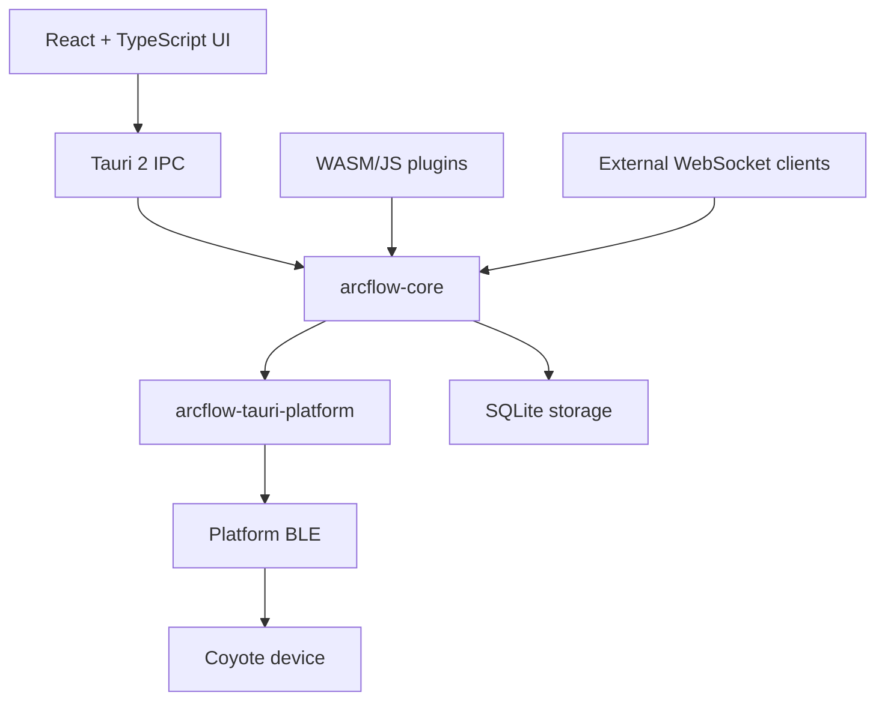

# ArcFlow Architecture

ArcFlow is a Rust-first, plugin-first client for compatible electrostimulation
devices. Desktop and mobile shells use Tauri 2 with a React UI; Rust owns device
access, safety, storage, protocol handling, plugins, scripts, and external
control.

## Runtime Shape

React does not call Bluetooth, SQLite, or plugin runtimes directly. UI commands
cross Tauri IPC into Rust. Plugins and external WebSocket clients also route
through Rust Core and capability checks before any device-facing operation.

## Workspace Crates

- `crates/core`: orchestration, safety limits, BLE seams, Coyote command
  builders, script execution, plugin API bridge, and external request routing.
- `crates/tauri-platform`: Tauri 2 desktop/mobile platform adapters. The current
  BLE scaffold exposes unsupported, permission-denied, powered-off, and ready
  scan states.
- `crates/protocol`: byte-level Coyote V2/V3 protocol parsing and command
  construction. It does not manage Bluetooth connections.
- `crates/wave`: safe wave-domain values and Coyote V3 window conversion.
- `crates/script`: safe script document model and compiler.
- `crates/plugin-runtime`: WASM/JavaScript plugin manifests, capabilities,
  sandbox policy, registry, runtime routing, and a deterministic recording
  runtime used until real WASM/JS engines are attached.
- `crates/storage`: SQLite schema and Rust-owned stores for plugin data,
  installed plugins, and scripts.
- `crates/external-control`: local WebSocket protocol and gateway.
- `crates/tauri-app`: shared Tauri 2 command/state wiring used by desktop and
  mobile shells.

## Device Flow

Platform BLE adapters emit advertisements and transport operations into Rust.
Core maps Coyote V2/V3 advertisements into `DeviceStatus`, builds safe Coyote V3
writes through `CoyoteV3CommandBuilder`, and sends bytes through `BleTransport`.

Bluetooth logic must stay in Rust. The future web target may add a separate Web
Bluetooth implementation, but desktop and mobile use Tauri 2 and Rust.

Desktop and mobile Tauri shells are intentionally thin. Each shell owns its
`tauri.conf.json` and platform entrypoint, then calls the shared
`arcflow-tauri-app` runtime.

## Plugin And External Control

Plugins support `wasm` and `javascript` runtimes. They run behind the Plugin API
and never receive direct Bluetooth access. External software connects through the
local WebSocket gateway and receives only the capabilities granted during hello.
Plugin manifests must point WASM runtimes at `.wasm` entries and JavaScript
runtimes at `.js` or `.mjs` entries.

Runtime engines exchange JSON envelopes with Rust Core. The stable invocation
and output shape is documented in `docs/plugins/runtime-abi.md`.

The current runtime implementation includes a recording adapter for JavaScript
and a WASM validation adapter. Bundle-backed WASM plugins are read from disk and
validated before lifecycle recording; manifest-only WASM plugins keep the
recording path for development. Runtime invocation still returns empty plugin
output while the engine call convention is being attached. Real engines will
replace these adapters behind the same `RuntimeAdapter` boundary.

Desktop startup restores the persisted plugin registry into this sandboxed
runtime host. UI and WebSocket plugin registry mutations update SQLite first,
then synchronize the Core-owned runtime lifecycle so enabled plugins are loaded
and disabled plugins are unloaded through the same path.

Current external routes include device status, wave control, script run,
script document management, and plugin registry management. See
`docs/external-control/websocket.md`.

## Script Flow

Script documents are stored in SQLite, validated by `crates/script`, and run
through a storage-backed Core runner. The runner compiles the document, enqueues
the compiled script, and a background worker executes steps through an injected
Core action executor. This keeps IPC responsive and gives future device/plugin
actions a replaceable boundary. Plugin hook script steps invoke enabled plugins
through the same sandboxed runtime host used by UI and WebSocket plugin
management.
